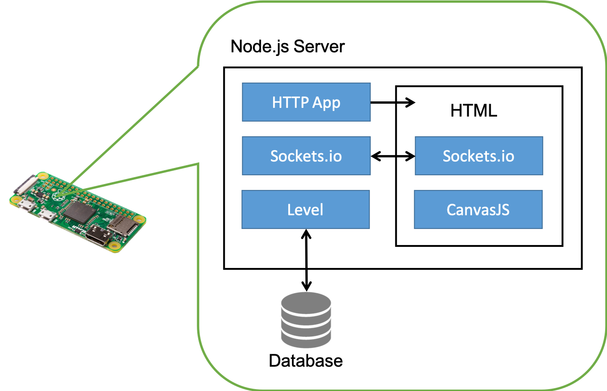
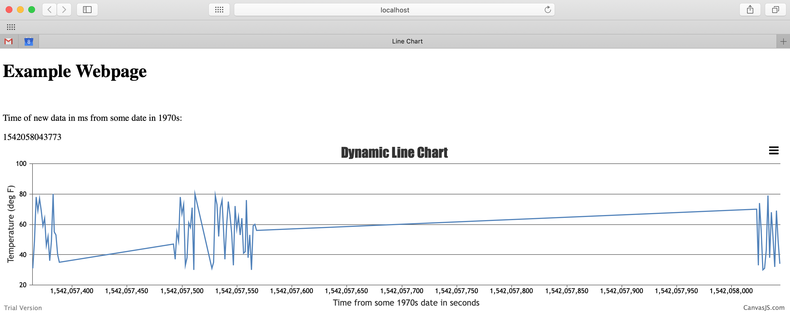

# Design Pattern – Databases + Visualization

Recall that we are using either table based or key-value structures
(see below).

<p align="center">

</p>
<p align="center">
<i>(a) Relational database, (b) Key/value stores</i>
</p>

We recommend the following design pattern to use with a database
(mongodb, levelDB, or tinggodb), CanvasJS, and node.js to realize data
storage, retrieval, and display.

1. Node.js web app running on raspberry pi
2. Client is served an html page on http get request to server
3. Server communicates with client in real time using sockets.io
4. Graphing is handled by a javascript module (CanvasJS)
5. Server communicates with a database

<p align="center">

</p>
<p align="center">
<i>Node.js Web App using LevelDB (or other DB)</i>
</p>

Here is some example code for how to get started with this
implementation: Node.js (javascript server), socket.io (realtime
communication), and canvasJS (graphing). We use LevelDB (database) but
really any DB can be used/

## Server-side

```js
// Modules
var level = require('level')
var express = require('express');
var app = require('express')();
var http = require('http').Server(app);
var io = require('socket.io')(http);

// Create or open the underlying LevelDB store
var db = level('./mydb', {valueEncoding: 'json'});

// Random number function -- this is a helper function to generate dummy data
function getRndInteger(min, max) {
    return Math.floor(Math.random() * (max - min + 1) ) + min;
}

// Points to index.html to serve webpage
app.get('/', function(req, res){
  res.sendFile(__dirname + '/index.html');
});

// Function to stream from database
function readDB(arg) {
  db.createReadStream()
    .on('data', function (data) {
      console.log(data.key, '=', data.value)
      // Parsed the data into a structure but don't have to ...
      var dataIn = {[data.key]: data.value};
      // Stream data to client
      io.emit('message', dataIn);
    })
    .on('error', function (err) {
      console.log('Oh my!', err)
    })
    .on('close', function () {
      console.log('Stream closed')
    })
    .on('end', function () {
      console.log('Stream ended')
    })
}

// When a new client connects
var clientConnected = 0; // this is just to ensure no new data is recorded during streaming
io.on('connection', function(socket){
  console.log('a user connected');
  clientConnected = 0;

  // Call function to stream database data
  readDB();
  clientConnected = 1;
  socket.on('disconnect', function(){
    console.log('user disconnected');
  });
});

// Listening on localhost:3000
http.listen(3000, function() {
  console.log('listening on *:3000');
});

// Every 15 seconds, write random information
function intervalFunc() {
  if (clientConnected == 1) {

    // Get current time
    var date = Date.now();

    // Fill in data structure
    var value = [{id: 1, temp: getRndInteger(30,80)}];

    // Put structure into database based on key == date, and value
    db.put([date], value, function (err) {
      if (err) return console.log('Ooops!', err) // some kind of I/O error
    })

    // Parse data to send to client
    var msg = {[date]: value};

    // Send to client
    io.emit('message', msg);

    // Log to console
    console.log(Object.keys(msg));
  }
}
// Do every 1500 ms
setInterval(intervalFunc, 1500);


```


## Client-side

```html
<!-- client side -->

<!doctype html>
<html>

<!-- HTML HEAD -->
<head>
	<title>Line Chart</title>
	<!-- Source for Canvas JS - points to the web - needs internet -->
	<script src="https://canvasjs.com/assets/script/canvasjs.min.js"></script>
	<!-- Source for Socket.io - this one is local -->
	<script src="/socket.io/socket.io.js"></script>

	<style>
  	canvas{
  		-moz-user-select: none;
  		-webkit-user-select: none;
  		-ms-user-select: none;
  	}
	</style>
</head>

<body>
	<!-- HTML layout -->
  <h1>Example Webpage</h1> <br>
  <p>Time of new data in ms from some date in 1970s: </p>
	<div id="message_disp"></div>
	<div id="chartContainer" style="height: 300px; width: 100%;"></div>

	<!-- Script to handle charting -->
	<script>
		var dps = [];
		var chart = new CanvasJS.Chart("chartContainer", {
			exportEnabled: true,
			animationEnabled: true,
			zoomEnabled: true,
			title :{
				text: "Dynamic Line Chart"
			},
			axisY: {
				includeZero: false,
        title : "Temperature (deg F)"
			},
      axisX: {
        title : "Time from some 1970s date in seconds"
			},
			data: [{
				type: "line",
				markerSize: 0,
				dataPoints: dps
			}]
		});

	</script>

	<!-- Script to handle socket and also to update chart datapoints -->
	<script>
    var timestamp;
    var deviceID;
    var temperature;
		var socket = io();
		socket.on('message', function(msg){

      // Parse received message from server
      console.log(msg);
      timestamp = Object.keys(msg);
      deviceID = msg[Object.keys(msg)][0].id;
      temperature = msg[Object.keys(msg)][0].temp;
			document.getElementById("message_disp").innerHTML =  Object.keys(msg);

			// Update data array
			dps.push({
				x: timestamp/1000,
				y: temperature
			});

			chart.render();

		});
	</script>

</body>

</html>
```

## Example Web Interface

<p align="center">

</p>
<p align="center">
<i>Example output with data persistence</i>
</p>

## References
- [Node.js Design Pattern](/docs/briefs/design-patterns/dp-nodejs.md)
- [Express](https://expressjs.com)
- [Socket.io](https://socket.io)
- [LevelDB](https://github.com/google/leveldb)
- [CanvasJS](https://canvasjs.com)
