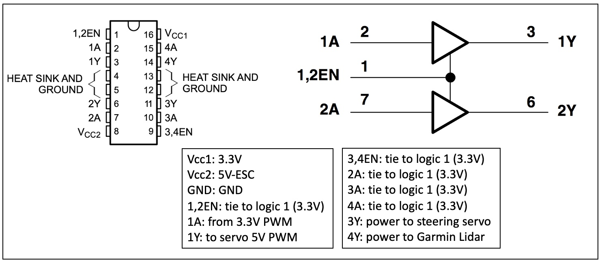
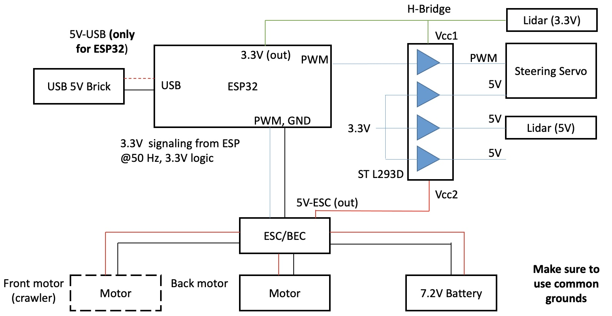

# Recipe for Interfacing ESP32 to Buggy/Crawler ESC, Steering, and Other High-Power Devices

## Powering High-Current Devices

There are several high-current devices you will want to power on the
buggy/crawler. These are the steering servo and the Lidars.

An H-bridge serves as a buffer to the fragile 3.3V logic levels that
come out of the ESP32. The bridge allows both level (voltage) and flow
(current) enhancements at the output stage. Essentially it realizes
low power input and high power output. But be careful with your wiring
and don't mix the input and output as you will cook things instantly.

<i>H-Bridge</i>

The figure below shows the schematic for using the ST L293D H-bridge
with the buggy. Please consult the part data sheet for additional
details as required.

  

<i>Using ESC for Powering Servos and Lidars</i>

Notes:
- ***Do not mix 5V from the ESP32 with 5V from the ESC***
- The ESC ***outputs*** 5V on the (red wire) connection
- The ESP32 outputs 3.3V on the PWM line, and this is tolerated by the ESC as an input

