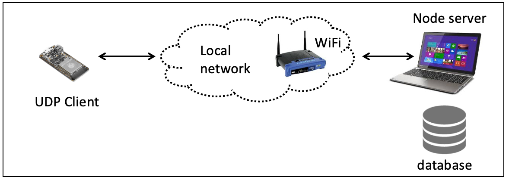

# Tingo DB Recipe

Tingo is a lightweight relational database manager that will run with
node on multiple platforms including the pi zero. It uses the same
syntax as mongoDB.  Recall that a relational database uses possibly
multiple tables. In this recipe we describe setting up a tingo DB with
a single table for sensor values originating from an ESP32. We show
writing to the DB. The tasks for reading or updating are left open.

<p align="center">

</p>
<p align="center">
<i></i>
</p>

This recipe can be combined with previous skills/examples:
- ESP32 data over serial port into node app 
- ESP32 data over serial to node app, then to HTML client, and to file 
- ESP32 data over wifi to node app, then to HTML client and to file

Here we describe snippets of the code found under [tingo-sensor-data](https://github.com/BU-EC444/04-Code-Examples/tree/main/tingo-sensor-data/). 

The configuration is the following:
1. `dummy-sensor` running on ESP with proper network IP address and port assignments
2. Node.js running on laptop, also with proper IP address and ports
3. Properly configured router for ESP, laptop
4. `dummy-sensor` sends payload every 2 sec to node server, with no acknowledgement
5. `server.js`, `server-csv.js`, and `server-db` are variants that consume the received data

`dummy-sensor` sends a string from an ESP32 over wifi to
the address of the node server using datagrams. The code based on using
the [ESP32 as a
client](https://github.com/espressif/esp-idf/tree/master/examples/protocols/sockets/udp_client)
except that we have removed the acknowlegement step. The payload has been
replaced with [0000 0001 0002 0003] and is sent every 2s. 


## Setup and test your environment
- Build and flash the `dummy-sensor` code onto your ESP32
- Run `server.js` or `server-csv.js` to establish data delivery
- Fiddle with your network until one of these works

## Start your data source
This is `dummy-sensor`.

## Using the base server.js, create a new file

Call it `server-new` that writes sensor values
to a db.

Here is the base `server.js`

```js
// UDP from the ESP32s part
var dgram = require('dgram');

// Port and IP
var PORT1 = 3001;            // Port of node server for UDP traffic
var HOST1 = '192.168.1.34';  // IP of node server

// Create socket
var server1 = dgram.createSocket('udp4');

const express = require('express');
const app = express();
var moment = require('moment-timezone'); // Import the moment-timezone library

// Gobal variable
var esp32_message ='0000 0001 0002 0003'; // This is the form of the payload

// UDP traffic from ESP32, no acknowlegement or error checking
// Create server that listens on a port
server1.on('listening', function () {
    var address = server1.address();
    console.log('UDP Server1 listening on ' + address.address + ":" + address.port);
});

// On connection, print out received UDP message and format
server1.on('message', function (message, remote) {
    console.log('Incoming data from: ' + remote.address + ':' + remote.port +' - ' + message);  
    const currTime = moment().format();    // Get current time from node server
    message = message.toString();          // Convert message to string
    const values = message.split(' ');     // Split into four values
    const first_val = parseInt(values[1]);
    const second_val = parseInt(values[2]);
    const third_val = parseInt(values[3]);
    const fourth_val = parseInt(values[4]);  
    final_message = "Formatted data: " + currTime + " " + first_val + " " + second_val + " " + third_val + " " + fourth_val;
    console.log(final_message); // send to console debug
    // DB part goes here
});

// Bind server to port and IP
server1.bind(PORT1, HOST1);
```
This code will produce formatted payload with timestamps onto the console. 
Next we will add the Tingo DB parts.

## First update your headers to include the DB

```js
var Engine = require('tingodb')();
var db = new Engine.Db('./mydb', {});
```
Then create the database folder: We created a folder in our running directory called `./mydb`

## Now add the part about writing to your DB

Replace
```js
    // DB Part goes here
```
With

```js
    // Database part: Log sensor data and time received
    var logCollection = db.collection('sensorlogs');
    var logEntry = { time: currTime,  first: first_val, second: second_val,
      third: third_val, fourth: fourth_val };
      logCollection.insert(logEntry, function(err, result) {
        if (err) throw err;
        console.log('Sensor data logged at:', currTime);
      });
```      

Run the new app with `node sensor-db.js` and see the results. You can
examine the db file with the command `more ./mydb/sensorlogs`


## Queries to the established database

You can add this code (after the DB write) to query the database. It
will return all entries, but display just the first one.

```js
    // Now read back (the whole DB!)
    db.collection('sensorlogs', function(err, collection) {
	if (err) throw err;
	collection.find().toArray(function(err, returned_data) {
	    if (err) throw err;
	    console.log("Database says: ", returned_data[1]); // Only show first element
	});
    });
```


Refining the query results is left for you to figure out based on your data flow needs.

## References
- [TingoDB](http://www.tingodb.com)
- [MongoDB Tutorial](https://www.w3schools.com/mongodb/)
- [Tingo Sensor Data Code Examples](https://github.com/BU-EC444/04-Code-Examples/tree/main/tingo-sensor-data)
