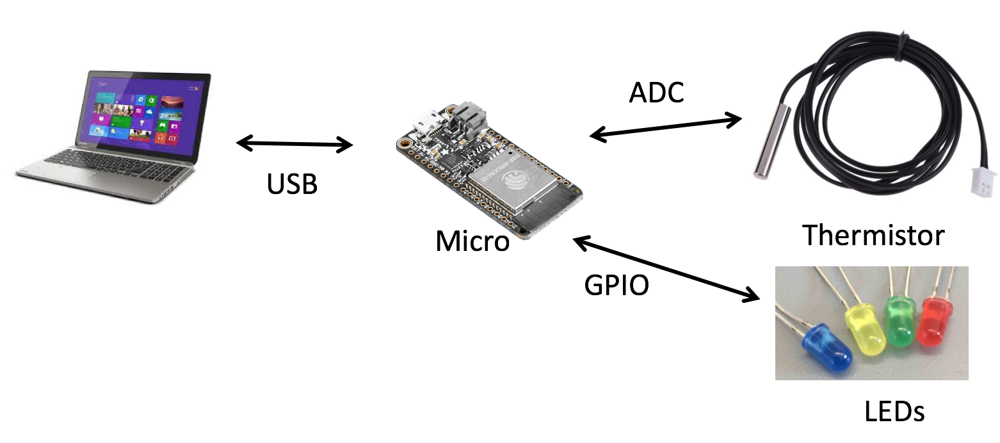

# RTOS -- Free RTOS

In this skill you will exercise the features of a real time OS (RTOS) as
realized by the ESP32 FreeRTOS instance.

It will be helful to refer to the [design
 pattern](/guides/design-patterns/dp-tasks) for tasks in FreeRTOS

One of the features of the RTOS is the scheduling of tasks based on
priority, particularly as it relates to timing. In the problem below,
your tasks will operate at different time scales and will interchange
data in a producer-consumer way. 

In our problem, one task will read data temerature via ADC at a
frequency of 100ms, saving the most recent 20 samples into a data
structure. A second task will compute the average value of the 20 most
recent samples every 2 seconds and send to the console. A third task
will compare the last two average values to indicate the direction of
temperature change: a positive change will be indicated by lighting a
red LED and a negative change will be indicated by a blue LED. No
change means a green LED.

Hardware Configuration

The scenario here is thus:

- Three tasks
  - Task A: read ADC temperature sensor, 100ms period
  - Task B: compute average over last 20 samples, write to console, 2s period
  - Task C: detect delta over last 2 values, set LEDs, 4s period
- RGB LEDs with 220 Ohm resistors please

## Assignment
1. Design these three tasks with timers (each task should be a separate FreeRTOS task
2. Identify how to communicate between tasks
2. Demonstrate
3. Report

## Reference material
- [Design Pattern for Tasks in FreeRTOS](/guides/design-patterns/dp-tasks)
- [ESP IDF Free RTOS](https://docs.espressif.com/projects/esp-idf/en/latest/api-reference/system/freertos.html)
- [Free RTOS Tutorial](https://www.freertos.org/tutorial/)
- [Mastering the FreeRTOS Real Time Kernel](https://www.freertos.org/Documentation/161204_Mastering_the_FreeRTOS_Real_Time_Kernel-A_Hands-On_Tutorial_Guide.pdf)
